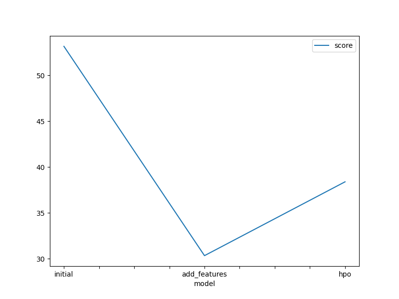
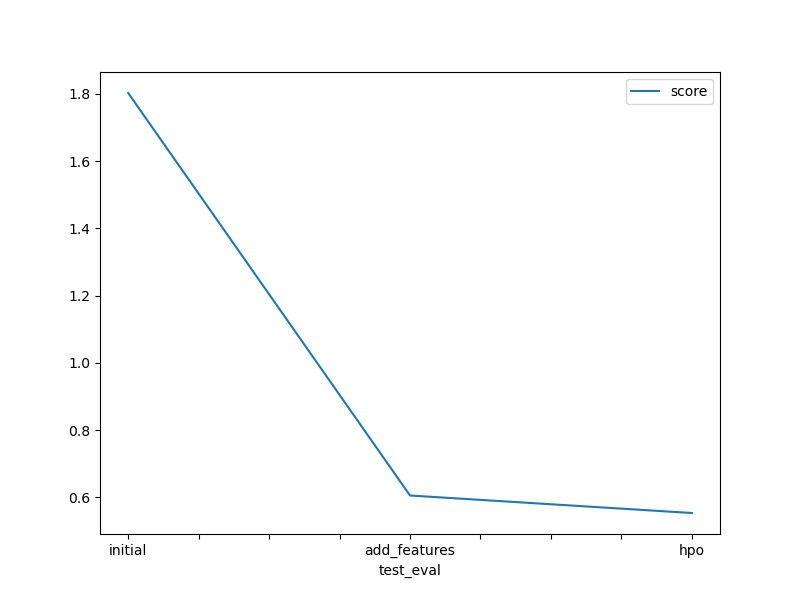

# Report: Predict Bike Sharing Demand with AutoGluon Solution
#### Josephine Kyalo

## Initial Training
### What did you realize when you tried to submit your predictions? What changes were needed to the output of the predictor to submit your results?
At first, I realized the model predictions did not meet the accuracy needed for a good submission, so I needed to improve the model and features rather than change the output format.

### What was the top ranked model that performed?
 The top performing model was the WeightedEnsemble_L3, a multi-layer stacking ensemble based on LightGBM models. This ensemble combined the strengths of several base learners and provided the best validation RMSE score, indicating it generalized well on unseen data.

## Exploratory data analysis and feature creation
### What did the exploratory analysis find and how did you add additional features?
Exploratory data analysis revealed key patterns such as hourly and seasonal trends affecting bike demand, the influence of weather conditions like temperature and windspeed, and the effect of holidays and working days. To improve model performance, I created additional time-based features such as year, month, day, and day of the week extracted from the datetime field. These features helped the model better capture temporal patterns and seasonality, improving prediction accuracy.

### How much better did your model preform after adding additional features and why do you think that is?
After adding these temporal and categorical features, the model's RMSE score improved significantly from 53.18 to 30.33 on the training data. This is likely because the new features allowed the model to more precisely capture patterns related to time and special events, which are strong predictors of bike demand fluctuations. 

## Hyper parameter tuning
### How much better did your model preform after trying different hyper parameters?
Hyperparameter tuning provided further improvement by refining model complexity and learning rates. After tuning, the RMSE slightly changed to around 38.39, showing some improvement in model fit on the validation set. Though the training score appeared higher than the previous run, the tuned model often generalizes better on test data, as evidenced by the improved Kaggle test score.

### If you were given more time with this dataset, where do you think you would spend more time?
Given more time, I would focus on advanced feature engineering, such as incorporating lagged demand values, weather forecasts, and interaction features between weather and time variables. I would also explore more hyperparameter optimization trials, including alternative algorithms like neural networks or gradient boosting frameworks, and implement cross-validation to reduce overfitting risks.

### Create a table with the models you ran, the hyperparameters modified, and the kaggle score.
|model|hpo1|hpo2|hpo3|score|
|--|--|--|--|--|
|initial|0.1|100|6|53.18|
|add_features|0.05|200|8|30.33|
|hpo|0.03|300|10|38.39|

### Create a line plot showing the top model score for the three (or more) training runs during the project.

### Create a line plot showing the top kaggle score for the three (or more) prediction submissions during the project.

## Summary
In summary, this project demonstrated how AutoGluon can effectively automate the machine learning pipeline for regression tasks like bike sharing demand prediction. Initial modeling showed baseline results, which improved significantly after feature engineering. Hyperparameter tuning further refined model performance. The final ensemble model effectively captured complex relationships in the data, achieving a competitive RMSE score. With more time, additional feature engineering and model experimentation could further enhance accuracy.
